# Terraform Webシステムテンプレート

## 構成一覧

### ALB + EC2 + RDS



## 準備

1. `AdministratorAccess`の権限を持ったIAMのアクセスキーを取得してAWS CLIに設定する

1. `tfstate`ファイルを保存するバケットを作成する

1. `provider.tf`の`bucket`を上記で作成したバケット名に変更する

    ```HCL
    bucket = "{prefix}-terraform-state"
    ```

1. 環境ディレクトリに移動

    ```bash
    cd {ディレクトリ名}
    ```

1. 変数定義ファイルをコピーして、必要に応じて変数を書き換える

    ```bash
    cp terraform.tfvars.example terraform.tfvars
    ```

## 実行手順

1. プラグインのインストール

    ```bash
    terraform init
    ```

1. 実行計画の表示

    ```bash
    terraform plan
    ```

1. リソースの適用

    ```bash
    terraform apply
    ```

1. リソースの削除

    ```bash
    terraform destroy
    ```
